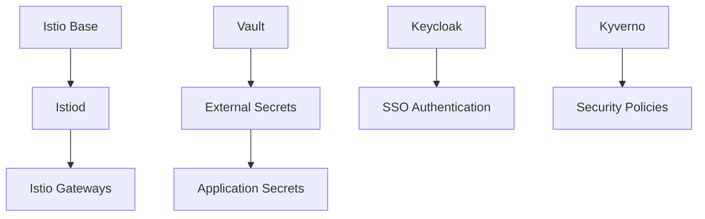

# 🏗️ Homelab Platform - Core Infrastructure Services

> **Foundation infrastructure layer** - Deploys core platform services including service mesh, identity management, secrets, and security policies through GitOps.

---

## 📖 Overview

This repository contains the **core infrastructure services** that form the foundation of the homelab platform. It's automatically deployed by ArgoCD after the GitOps bootstrap, providing essential services like Istio service mesh, HashiCorp Vault, Keycloak identity management, and security policies.

### 🎯 Repository Purpose

- Deploy core infrastructure services (Istio, Vault, Keycloak)
- Establish service mesh and networking foundation
- Provide secrets management and identity services
- Implement security policies and governance
- Create integration points for monitoring and applications

---

## 🏗️ Repository Structure

homelab-platform/
├── environments/                    # Environment-specific configurations
│   ├── dev/
│   │   ├── 01-infrastructure/      # Base infrastructure (Istio, namespaces)
│   │   │   ├── namespaces.yaml
│   │   │   ├── kustomization.yaml
│   │   │   └── values/             # Helm values for infrastructure
│   │   ├── 02-platform-services/  # Core platform services
│   │   │   ├── external-secrets/
│   │   │   ├── istio-gateways.yaml
│   │   │   ├── vault-setup.yaml
│   │   │   ├── kustomization.yaml
│   │   │   └── values/             # Helm values for services
│   │   ├── 03-platform-integrations/ # Service integrations
│   │   │   ├── cilium-loadbalancer.yaml
│   │   │   ├── elastic-resources.yaml
│   │   │   └── kustomization.yaml
│   │   └── platform-apps/         # ArgoCD app definitions
│   │       ├── platform-infrastructure-app.yaml
│   │       ├── platform-services-app.yaml
│   │       └── platform-integrations-app.yaml
│   ├── staging/                    # Staging environment configs
│   └── prod/                      # Production environment configs
└── docs/                          # Documentation

---

## 🔧 Core Services Deployed

### 🏗️ Infrastructure Layer (01-infrastructure)

| Service | Purpose | Configuration |
|:--------|:--------|:--------------|
| **Istio Base** | Service mesh foundation | `values-istio-base.yaml` |
| **Istiod** | Control plane for service mesh | `values-istiod.yaml` |
| **Namespaces** | Isolated environments for services | `namespaces.yaml` |

### 🔐 Platform Services (02-platform-services)

| Service | Purpose | Configuration |
|:--------|:--------|:--------------|
| **HashiCorp Vault** | Secrets management and PKI | `values-vault.yaml` |
| **Keycloak** | Identity and access management | `values-keycloak.yaml` |
| **External Secrets** | Vault → K8s secrets integration | `values-external-secrets.yaml` |
| **Kyverno** | Policy engine for governance | `values-kyverno.yaml` |
| **ECK Operator** | Elasticsearch operator | `values-eck-operator.yaml` |

### 🔗 Platform Integrations(03-platform-integrations)

| Component | Purpose | File |
|:----------|:--------|:-----|
| **Cilium LoadBalancer** | Service load balancing | `cilium-loadbalancer.yaml` |
| **Elastic Resources** | Logging infrastructure setup | `elastic-resources.yaml` |
| **Istio Gateways** | Ingress and traffic management | `istio-gateways.yaml` |

---

## 🚀 Deployment Process

### Automatic Deployment

This repository is **automatically deployed by ArgoCD** from the homelab-gitops repository. No manual intervention required.

### Deployment Order

Services deploy in layered approach:
```
1. 🏗️ Infrastructure    ← Istio, namespaces, base services
2. 🔐 Platform Services ← Vault, Keycloak, security policies  
3. 🔗 Integrations     ← LoadBalancers, gateways, resources
```

### Per-Environment Deployment

Each environment deploys the same services with environment-specific configurations:

- **Dev**: Lightweight configs, relaxed security for testing
- **Staging**: Production-like configs for validation
- **Prod**: Full security, HA configurations

---

## 🔐 Security & Identity

### HashiCorp Vault

- **Purpose**: Centralized secrets management
- **Features**: Dynamic secrets, PKI, encryption as a service
- **Integration**: External Secrets Operator syncs to K8s secrets

### Keycloak Identity Management

- **Purpose**: Single sign-on and identity provider
- **Protocols**: OIDC, SAML, OAuth2
- **Integration**: Provides authentication for all platform services

### External Secrets Operator

- **Purpose**: Sync secrets from Vault to Kubernetes
- **Benefits**: No secrets in Git, automatic rotation
- **Configuration**: `external-secrets/` directory

---

## 🌐 Service Mesh & Networking

### Istio Service Mesh

- **Traffic Management**: Intelligent routing, load balancing
- **Security**: mTLS encryption, authorization policies  
- **Observability**: Distributed tracing, metrics collection

### Cilium Networking

- **LoadBalancer IPAM**: Automatic IP assignment for services
- **Network Policies**: Secure communication between services
- **Integration**: Works with Istio for complete networking solution

---

## 📊 Monitoring Integration

### Service Monitoring

Platform services are automatically monitored by:

- **Prometheus**: Metrics collection from all services
- **Grafana**: Dashboards for platform health
- **Jaeger**: Distributed tracing through Istio

### Service URLs

Access platform services through Istio service mesh:

- **Vault**: `vault.dev.cluster.local`
- **Keycloak**: `keycloak.dev.cluster.local`
- **Istio Kiali**: `kiali.dev.cluster.local`

### Health Checks

```bash
# Check Istio components
kubectl get pods -n istio-system

# Verify Vault status
kubectl get pods -n vault

# Check Keycloak deployment
kubectl get pods -n keycloak

# View External Secrets sync status
kubectl get secretstore -A
```

---

## 🔧 Configuration Management

### Environment-Specific Values

Each environment overrides default values:

**Development** (`dev/values/`):

- Reduced resource requirements
- Relaxed security policies
- Debug logging enabled

**Production** (`prod/values/`):

- High availability configurations
- Strict security policies
- Optimized resource allocation

### Secrets Management

- **Vault Secrets**: Stored in HashiCorp Vault
- **K8s Integration**: External Secrets Operator
- **Zero Git Secrets**: No sensitive data in repository

---

## 🔍 Troubleshooting

### Common Issues

| Issue | Check | Solution |
|:------|:------|:---------|
| Istio pods pending | Resource limits | Increase node capacity or reduce requests |
| Vault sealed | Initialization status | Follow Vault unsealing procedure |
| External secrets failing | Vault connectivity | Check vault-setup.yaml configuration |
| Gateway not accessible | LoadBalancer IP | Verify Cilium LoadBalancer pool |

### Diagnostic Commands

```bash
# Check ArgoCD application status
kubectl get applications -n argocd | grep platform

# Verify Istio installation
istioctl verify-install

# Check Vault status
kubectl exec -n vault vault-0 -- vault status

# View External Secrets logs
kubectl logs -n external-secrets -l app.kubernetes.io/name=external-secrets
```

---

## 🔗 Dependencies & Integration

### Upstream Dependencies

- **homelab-gitops**: Deploys this repository via ArgoCD
- **K3s cluster**: Provides Kubernetes foundation
- **Cilium CNI**: Network connectivity and load balancing

### Downstream Dependencies  

This platform enables:

- **homelab-monitoring**: Prometheus, Grafana, logging stack
- **homelab-apps**: User applications with authentication and networking

### Service Dependencies



---

## 🌟 Key Features

### 🔒 **Security First**

- Policy-driven security with Kyverno
- mTLS everywhere via Istio
- Centralized secrets management
- Zero-trust networking

### 🎯 **Production Ready**

- High availability configurations
- Automated backup and recovery
- Comprehensive monitoring integration
- GitOps-based lifecycle management

### 🔄 **Scalable Architecture**

- Environment-specific configurations
- Modular service deployment
- Easy addition of new services
- Independent service lifecycle

---

## 📚 Next Steps

After platform deployment:

1. **Verify Services**: Check all platform services are healthy
2. **Configure Vault**: Set up secrets for downstream applications  
3. **Setup Keycloak**: Configure identity providers and users
4. **Deploy Monitoring**: Platform provides foundation for observability
5. **Deploy Applications**: Services ready for application workloads

---

*🏗️ This platform provides the secure, scalable foundation for your entire homelab. All other services build upon this infrastructure layer.*